    


# 概述

面向NVIDIA GPU，使用CUDA编程逐步优化矩阵乘法运算性能：

| 核函数   | 描述                    | GFLOPS   | 自定义核函数/CUBLAS（%） |
| -------- | ----------------------- | -------- | ------------------------ |
| CUBLAS   | 官方库函数              | 14448.69 | 基准                     |
| kernel_1 | 朴素实现                | 2262.168 | 15.65657                 |
| kernel_2 | 共享内存缓存            | 4216.536 | 29.18283                 |
| kernel_3 | 一维Thread Tile并行优化 | 7809.629 | 54.05078                 |
| kernel_4 | 二维Thread Tile并行优化 | 12251.3  | 84.79179                 |
| kernel_5 | 寄存器缓存              | 12177.95 | 84.28412                 |
| kernel_6 | FLOAT4向量访存          | 13161.49 | 91.09125                 |
| kernel_7 | 双缓存预取              | 13634.98 | 94.36832                 |

> NVIDIA GeForce RTX 3090，矩阵尺寸5120

# 配置

- 编译采用 `gcc 7.5.0` under Ubuntu 18.04.5 LTS
- NVIDIA CUDA version: `CUDA 10.2`；

# 目录

```
NVIDIA_SGEMM_PRACTICE                                   # 根目录
    ├── images                                          # 图片结果
    │     ├── describe_kernel_1.png  
    │     ├── describe_kernel_x.png
    │     └── kernel_x_vs_y.png
    ├── test                                            # 测试结果
    │     ├── test_kernel_0.txt 
    │     ├── test_kernel_1.txt 
    │     └── test_kernel_x.txt 
    └── src                                             # 源文件
    │    ├── kernel
    │    │  ├── kernel_1.cuh                            # 声明和定义
    │    │  ├── kernel_2.cuh
    │    │  └── kernel_x.cuh
    │    ├── kernel.cuh
    │    ├── utils.cuh                                  # 辅助函数
    │    └── utils.cu
    ├── plot.py                                         # 根据test结果绘图
    ├── run.sh                                          # 运行编译后可执行文件
    ├── sgemm.cu                                        # 主程序
    └── CMakeLists.txt                                  # 编译相关
```

# 运行
1. 配置NVCC编译参数
> 在CMakeLists.txt中修改`set(CUDA_NVCC_FLAGS -arch=compute_70;-code=compute_70)`
2. 配置矩阵计算最大尺寸
> 在`sgemm.cu:16`中修改`size_len`，建议初次运行设置为16，过大尺寸可能导致电源超负荷主机重启；
3. 编译
`cd build && cmake .. && make`
4. 运行run.sh，统计各个核函数计算效率，结果保存在test目录；
5. 计算效率折线绘图

> `python plot.py 0 1`表示绘制CUBLAS和kernel_1计算效率对比图；

# 逐步优化

##  kernel 1 

**Naive基础版矩阵乘法实现**

将每个逻辑线程与矩阵C的每一个元素相对应，每个线程负责C中一个元素的计算；

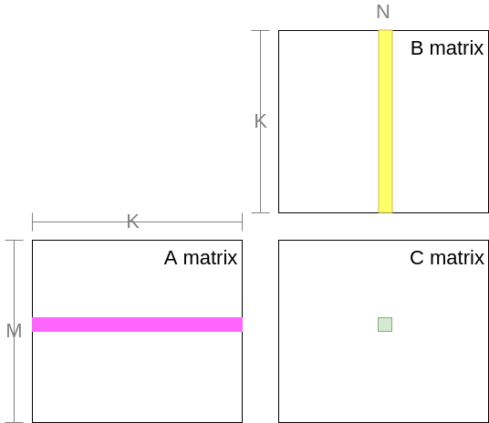

```cpp
__global__ __launch_bounds__(1024) void
mysgemm_v1(int M, int N, int K, float alpha, float *A, float *B, float beta, float *C) {

    int gx = blockIdx.x * blockDim.x + threadIdx.x; // 全局x
    int gy = blockIdx.y * blockDim.y + threadIdx.y; // 全局y

    float tmp = 0.;
    for (int i = 0; i < K; i++) {
        tmp += A[gy * K + i] * B[i * N + gx]; // 两次全局内存访问和一次FMA（累加乘）
    }
    C[gy * N + gx] = alpha * tmp + beta * C[gy * N + gx];
}
```

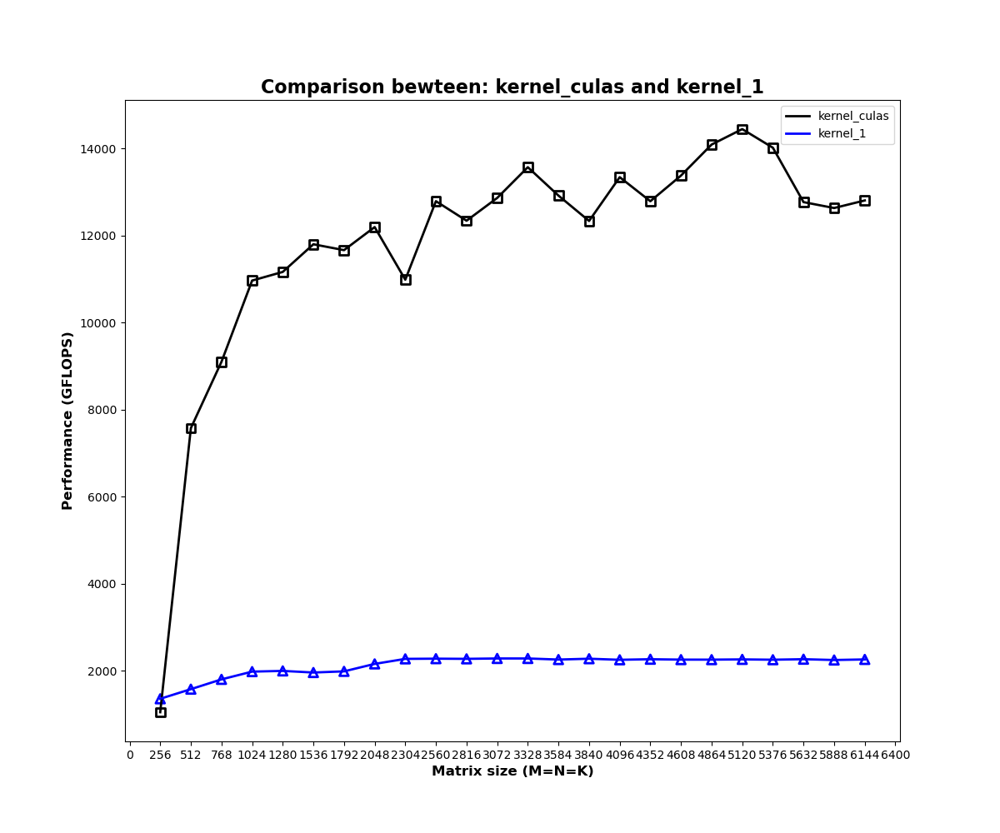

未经过优化的矩阵乘法性能不足CUBLAS的1/10，具体分析如下；

- 计算访存比：每次迭代需要进行一次FMA（乘累加）和两次全局内存读取，计算访存比1/2；
- 访存量：访问全局内存，C矩阵每个元素计算需要访问`2K`个单精度浮点数，完成全部计算需要` 2*K*M*N`；

全局内存访问延迟高（几百cycle），同时相同位置元素被重复读取（C中同一行元素计算共享A中同一行元素，C中同一列元素计算共享B中同一列元素），另一方面，较低的计算访存比无法有效隐藏访存延迟，因此，访存延迟和计算访存比是导致kernel 1效率低下的原因。

## kernel 2

**利用共享内存缓存减少全局内存访存量和访存延迟**

访存延迟来自于全局内存的高延迟和全局内存的重复访问。共享内存是片上内存，具有较低的访存延迟（几十cycle）,使用共享内存进行缓存可降低访存延迟；

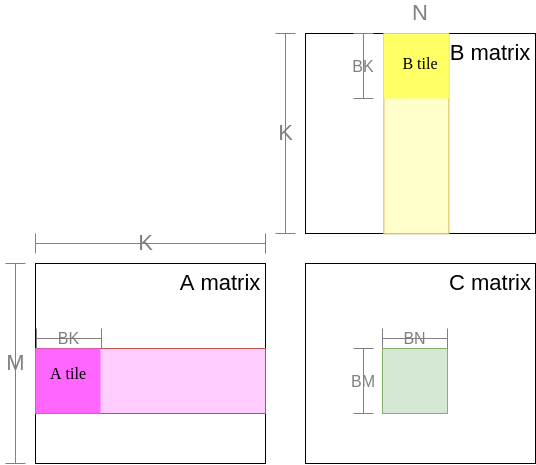

> BM和BN表示block tile的高和宽，BK表示待缓存的全局内存的步长，即一个block的计算需要缓存K/BK次；

共享内存缓存全局内存A tile和B tile，完成C block中所有元素的FMA计算，不断滑动缓存区域，更新block；

```cpp
/*
dim3 blockDim(1024);
dim3 gridDim(CEIL_DIV(M, 32), CEIL_DIV(N, 32));
mysgemm_v2<32><<<gridDim, blockDim>>>(M, N, K, alpha, A, B, beta, C);
*/

template<const int BLOCK_SIZE>
__global__ void mysgemm_v2(int M, int N, int K, float alpha, float *A, float *B, float beta, float *C) {
    int bx = blockIdx.x;
    int by = blockIdx.y;

    const int BM = BLOCK_SIZE;
    const int BN = BLOCK_SIZE;
    const int BK = BLOCK_SIZE;
    
    int tx = threadIdx.x % BN;
    int ty = threadIdx.x / BN;

    // 申请共享内存空间
    __shared__ float As[BM * BK];
    __shared__ float Bs[BK * BN];

    // 移动到当前block
    A = &A[by * BM * K];
    B = &B[bx * BN];
    C = &C[by * BM * N + bx * BN];

    float tmp = 0.;
    for (int k = 0; k < K; k += BK) {
        // 缓存A_tile和B_tile
        As[ty * BK + tx] = A[ty * K + tx];
        Bs[ty * BN + tx] = B[ty * N + tx];
        // 同步所有线程缓存完成
        __syncthreads();
        A += BK;
        B += BK * N;
        for (int i = 0; i < BK; i++) {
            tmp += As[ty * BK + i] * Bs[i * BN + tx];
        }
        // FMA计算需要读取缓存数据，在新一轮写入缓存前进行同步，确保所有线程计算完成
        __syncthreads();
    }
    C[ty * N + tx] = alpha * tmp + beta * C[ty * N + tx];
}
```

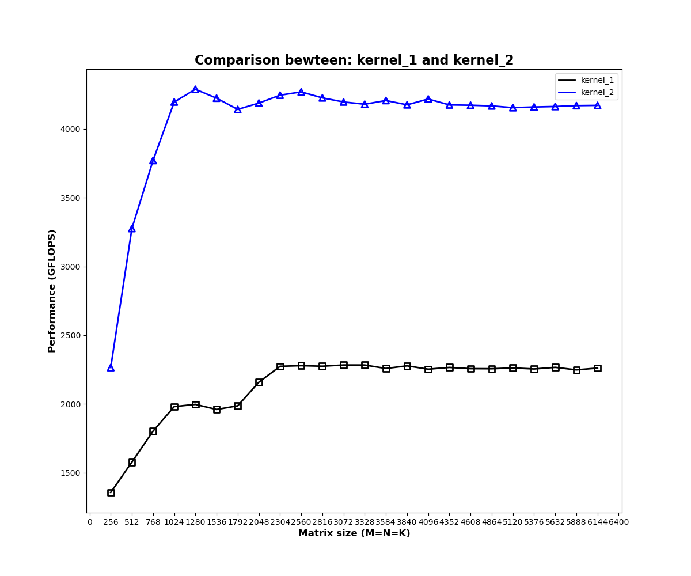

- 访存量：每个block需要从global memory中读取`(K/BK)*(BM*BK+BK*BN)`个单精度浮点数，整个C存在`(M/BM)*(N/BN)`个block，因此完成C中所有元素计算需要读取`(M/BM)*(N/BN)*(K/BK)*(BM*BK+BK*BN)`个单精度浮点数

kernel 1受限于全局内存的访存延迟和重复访问，优化前全局访存量为`2*K*M*N`，共享内存缓存优化后，访存量减少为原来的`1/2*(1/BN)*(1/BM)`,当`BN=BM=32`时，访存减少至1/32；另一方面shared memory访存延迟远低于全局内存，因此计算效率得到了一定程度的提升。

## kernel 3

**利用一维thread tile优化**

已知可以通过增加block大小（BM，BN）值，进一步降低全局内存的访问量，因此将BM和BN从32提升至64；

> **是否能通过无限增加block size降低全局访存？**
>
> 不能，一方面，block分块矩阵尺寸过大，block数量减少，这样会造成大量 SM（Streaming Multiprocessor）的闲置浪费；另一方面，BN和BM的增加，需要申请更多的共享内存，单线程内共享内存占用越多，活跃线程束越少，不利于隐藏指令延迟；

因此，在增加BM和BN值的同时，为了减少共享内存占用，一方面减小BK值，降低为8；

> 当增加block size时，应尤其注意共享内存的消耗，限制共享内存尺寸和block中线程的数量，避免因资源不足无法启动核函数

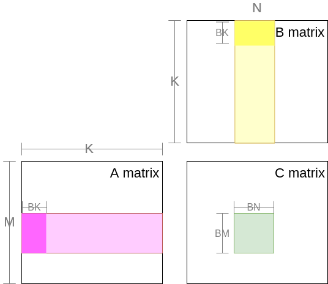

另一方面，通过共享内存缓存减少了全局内存访存量和FMA乘累加的访存延迟，但计算访存比没有得到改善，每次迭代计算都需要两个访存指令和一个计算指令，因此，引入thread tile，即一个线程负责block中多个元素的计算，TM和TN分别表示thread tile的高和宽。

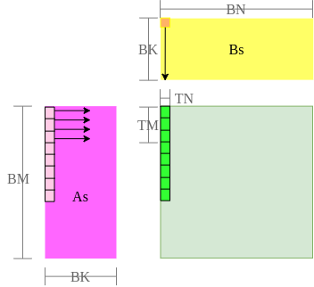

```cpp
/*
dim3 blockDim(512);
dim3 gridDim(CEIL_DIV(M, 64), CEIL_DIV(N, 64));
mysgemm_v3<64, 64, 8, 8><<<gridDim, blockDim>>>(M, N, K, alpha, A, B, beta, C);
*/


template<const int BM,
        const int BN,
        const int BK,
        const int TM>
__global__ void mysgemm_v3(int M, int N, int K, float alpha, float *A, float *B, float beta, float *C) {
    int bx = blockIdx.x;
    int by = blockIdx.y;
    int thread_num = BM * BN / TM; // 一个线程负责block中计算TM个元素

    int tx = threadIdx.x % BN;
    int ty = threadIdx.x / BN * TM;

    __shared__ float As[BM * BK];
    __shared__ float Bs[BK * BN];

    // 移动到当前block
    A = &A[by * BM * K];
    B = &B[bx * BN];
    C = &C[by * BM * N + bx * BN];

    /*
    当前线程负责搬运全局内存中第a_tile_row行，第a_tile_col列元素至共享内存第a_tile_row行，第a_tile_col列
    a_tile_stride表示block中线程可搬运a_tile_stride行至共享内存；

    若BM=64,BK=8,thread_num=512,则a_tile_stride=64,a_tile_stride=BM，表示每个线程搬运一轮即可完成所需元素的搬运;
    若BM=128,BK=8,thread_num=512,则a_tile_stride=64,表示每个线程搬运两轮即可完成所需元素的搬运;
    */
    int a_tile_row = threadIdx.x / BK;
    int a_tile_col = threadIdx.x % BK;
    int a_tile_stride = thread_num / BK;

    int b_tile_row = threadIdx.x / BN;
    int b_tile_col = threadIdx.x % BN;
    int b_tile_stride = thread_num / BN;

    float tmp[TM + 1] = {0.}; // 每个线程负责TM个元素，则需要申请TM个寄存器保存累加值，额外的一个寄存器用于缓存；
    #pragma unroll
    for (int k = 0; k < K; k += BK) {
        #pragma unroll
        for (int i = 0; i < BM; i += a_tile_stride) {
            As[(a_tile_row + i) * BK + a_tile_col] = A[(a_tile_row + i) * K + a_tile_col];
        }
        #pragma unroll
        for (int i = 0; i < BK; i += b_tile_stride) {
            Bs[(b_tile_row + i) * BN + b_tile_col] = B[(b_tile_row + i) * N + b_tile_col];
        }
        __syncthreads();
        A += BK;
        B += BK * N;
        #pragma unroll
        for (int i = 0; i < BK; i++) {
            tmp[TM] = Bs[tx + i * BN]; // 额外的一个寄存器，避免反复从共享内存中读取Bs[tx + i * BN]
            #pragma unroll  // 循环展开，增加指令并行度
            for (int j = 0; j < TM; j++) {
                tmp[j] += As[(ty + j) * BK + i] * tmp[TM];
            }
        }
        __syncthreads();
    }
    #pragma unroll
    for (int j = 0; j < TM; j++) {
        C[(ty + j) * N + tx] = alpha * tmp[j] + beta * C[(ty + j) * N + tx];
    }
}
```

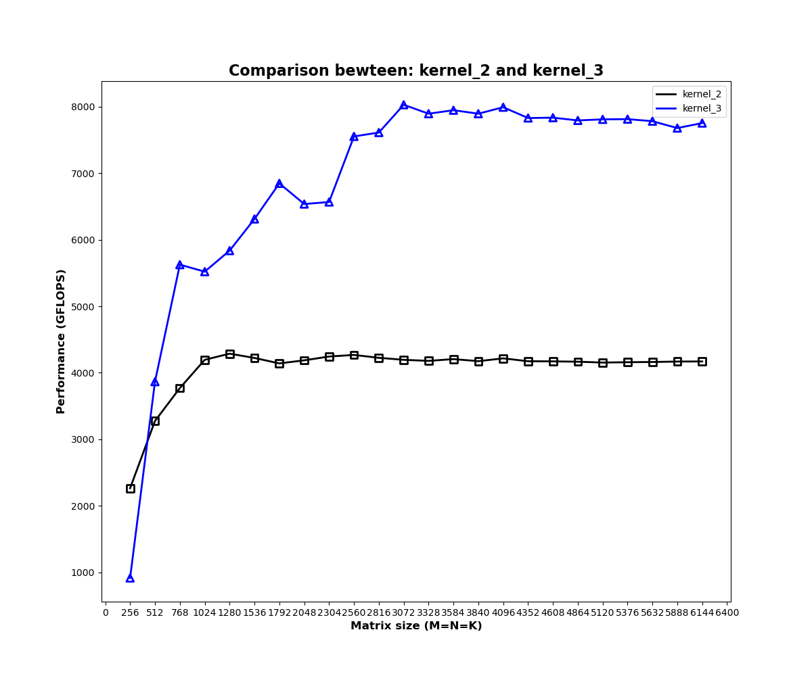

本例从两方面进行优化：

- 全局内存访存量：相比于初始版本，通过对`64*64`block size进行缓存，访存量降至1/64；
- 计算访存比：引入thread tile，利用单个线程负责多个元素计算，增加计算访存比；当TM=8时，每执行共享内存As的8个次访存指令和共享内存Bs的1个访存指令，可执行8次计算指令，相比初始版本的计算访存比1:2，提高至8:9，有效隐藏访存延迟；

通过本例的两方面优化，矩阵乘法计算效率显著提高近一倍；

## kernel 4

**利用二维thread tile优化**

将thread tile设置为二维，即一个线程负责一小块元素的计算，从而进一步增加block尺寸，减少全局访存数量；

>  增加thread tile尺寸，可以在相同的线程数量或更少的线程数量下，计算更大的block size;

更重要的是，单线程负责计算更多的C元素区域，可以增加指令级并行程度；

> 为什么可以提高指令并行程度？
>
> 单线程处理的指令数量越多，流水线级越长，由于单线程流水线可并行处理多条指令，虽然单条指令执行变慢，但单位时间内处理的指令数量变多，提高了吞吐量，隐藏指令延迟；指令级并发相比与线程级并发更具优势。

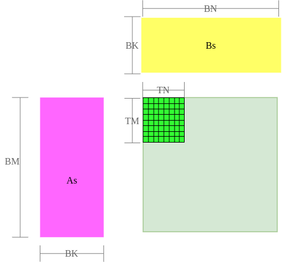

设置一个线程负责8×8区域内元素计算，即thread tile=8×8，TM=8,TN=8；

```cpp
// BM=BN=128，BK=8，TM=TN=8，共享内存大小128*8
dim3 blockDim(256);
dim3 gridDim(CEIL_DIV(M, 128), CEIL_DIV(N, 128));
mysgemm_v4<128, 128, 8, 8, 8><<<gridDim, blockDim>>>(M, N, K, alpha, A, B, beta, C);

    int a_tile_row = threadIdx.x / BK;
    int a_tile_col = threadIdx.x % BK;
    int a_tile_stride = thread_num / BK;  // 128*8/256=4，需要所有线程搬运4轮，可将全局内存中128*8大小区域搬运至共享内存

    int b_tile_row = threadIdx.x / BN;
    int b_tile_col = threadIdx.x % BN;
    int b_tile_stride = thread_num / BN;

// 每个线程负责TM*TN个元素，则需要申请TM*TN个寄存器保存累加值；
float tmp[TM][TN] = {0.}; 

// 单个线程循环TM，TN完成thread tile内元素的乘累加
for (int j = 0; j < TM; j++) {
    for (int l = 0; l < TN; l++)
        tmp[j][l] += As[(ty + j) * BK + i] * Bs[tx + l + i * BN];
}
```

全局访存量：相比未引入共享内存缓存版本，全局内存访存量减少至`1/2*(1/BM+1/BN)=1/128`,访存量显著降低。

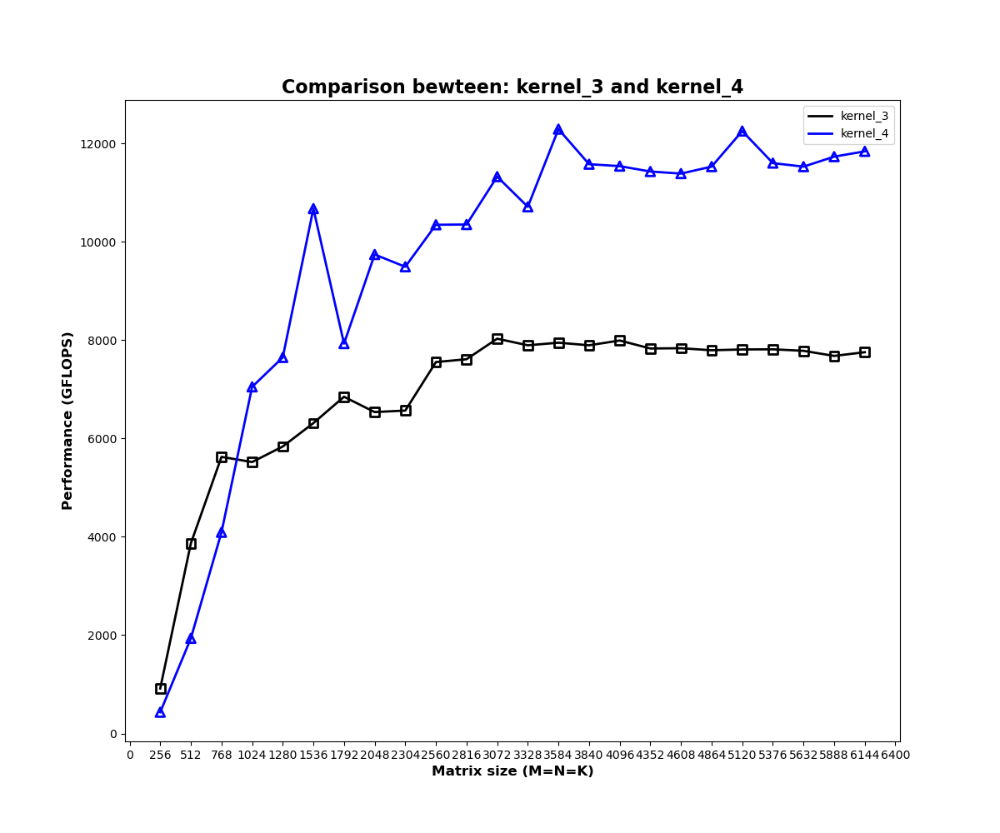

实际测试发现，相比与一维thread tile，由于二维thread tile进一步降低了全局访存量、提升计算访存比，矩阵乘法效率显著提升一倍。

## kernel 5

**寄存器缓存共享内存**

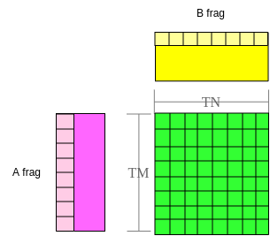

由下方代码可知，单个线程计算thread tile元素乘累加时，共享内存会被重复访问。

```cpp
for (int j = 0; j < TM; j++) {
    for (int l = 0; l < TN; l++)
        tmp[j][l] += As[(ty + j) * BK + i] * Bs[tx + l + i * BN];  //内层循环中 As[(ty + j) * BK + i] 重复访问TN次
}
```

共享内存相比全局内存能够大大减少访存延迟，但共享内存延迟（几十cycle）相比于计算延迟（几cycle）仍然较大，因此，采用寄存器对共享内存As、Bs进行缓存，避免共享内存的重复访问；

```cpp
float a_frag[TM] = {0.};
float b_frag[TN] = {0.};

for (int i = 0; i < BK; i++) {
    for (int j = 0; j < TM; j++) {
        a_frag[j] = As[(ty + j) * BK + i];     // 采用a_frag寄存器数组缓存thread tile所需的As共享内存数据；
    }
    for (int l = 0; l < TN; l++) {
        b_frag[l] = Bs[tx + l + i * BN];       // 采用b_frag寄存器数组缓存thread tile所需的Bs共享内存数据；
    }
    for (int j = 0; j < TM; j++) {
        for (int l = 0; l < TN; l++)
            tmp[j][l] += a_frag[j] * b_frag[l];
    }
}
```

当TM=TN=8时，经过寄存器缓存，每个thread tile需要执行8个As共享内存访存指令和8个Bs共享内存访存指令，可进行8×8=64个计算指令，计算访存比相比于初始版本的1/2提升至64:16，可有效隐藏访存延迟；

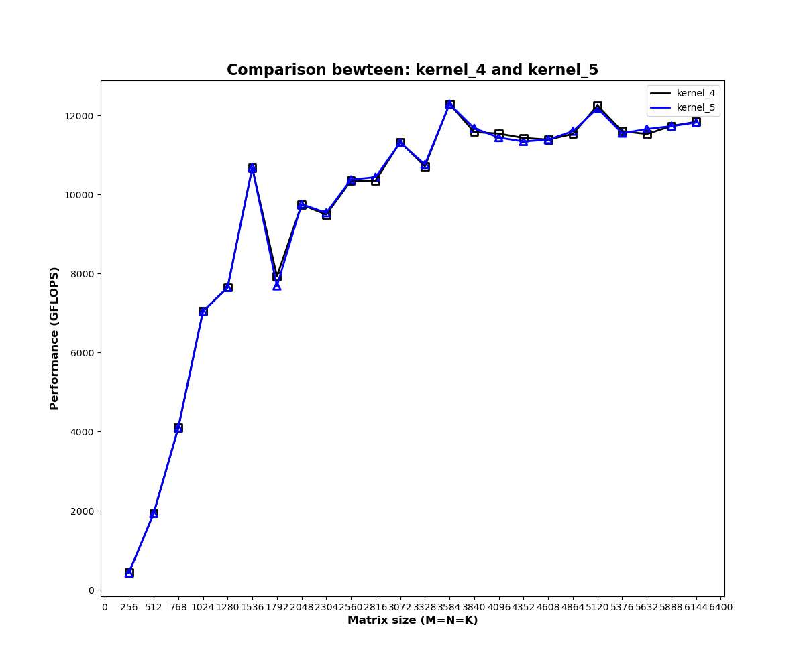

实际测试发现，经寄存器缓存实际性能并未发生明显变化，原因可能是当前性能瓶颈并非共享内存的重复访问；

## kernel 6

**向量内存指令FLOAT4优化**

- 计算指令：GPU是以4维向量为基本单位进行计算的，4个浮点数组成的float4向量是GPU最基本的类型，使用GPU对两个float4进行向量计算与对两个整数或两个浮点数进行计算一样，只需要一个指令即可完成；
- 内存指令：与发出单个指令生成单独的内存事务获取相同数量的字节相比，通过向量内存指令所需的内存事务更少，减少了内存控制器的争用；另一方面，使用矢量加载每个字节需要更少的索引计算；

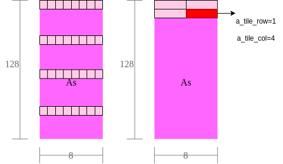

例如，BM=128，BK=8，线程数量为256，若每个线程每次取1个浮点数，每个线程需要消耗4次内存指令，才能将全局内存搬运至共享内存，若采用float4向量内存指令，每个线程每次可以搬运4个浮点数，则每个线程仅需要执行一次内存指令即可完成搬运。

关键代码示例如下：

```cpp
#define OFFSET(row, col, ld) ((row)*(ld)+(col))
#define FETCH_FLOAT4(pointer) (reinterpret_cast<float4*>(&(pointer))[0])

float ldg_a_reg[4 * ldg_a_num] = {0.}; // 每个线程搬运ldg_a_num轮，寄存器缓存ldg_a_num个float4元素，用于转置As矩阵

//  共享内存缓存全局内存
for (int i = 0; i < BM; i += a_tile_stride) {
    int ldg_index = i / a_tile_stride * 4;  // 第ldg_index轮
    FETCH_FLOAT4(ldg_a_reg[ldg_index]) =
            FETCH_FLOAT4(A[OFFSET(a_tile_row + i, a_tile_col, K)]);
    // As转置存，其中ldg_a_reg做中间缓存，目的是读取时可以按FLOAT4读取
    As[OFFSET(a_tile_col, i + a_tile_row, BM)] = ldg_a_reg[ldg_index];
    As[OFFSET(a_tile_col + 1, i + a_tile_row, BM)] = ldg_a_reg[ldg_index + 1];
    As[OFFSET(a_tile_col + 2, i + a_tile_row, BM)] = ldg_a_reg[ldg_index + 2];
    As[OFFSET(a_tile_col + 3, i + a_tile_row, BM)] = ldg_a_reg[ldg_index + 3];
}

for (int i = 0; i < BK; i += b_tile_stride) {
    FETCH_FLOAT4(Bs[OFFSET(b_tile_row + i, b_tile_col, BN)]) =
        FETCH_FLOAT4(B[OFFSET(b_tile_row + i, b_tile_col, N)]); // 不需要转置
}


// 寄存器缓存共享内存
// ty,tx为当前线程对应thread tile的左上角元素在block中的位置
#pragma unroll
for (int m = 0; m < TM; m += 4) {
    FETCH_FLOAT4(a_frag[m]) = FETCH_FLOAT4(As[OFFSET(i, ty + m, BM)]); // 偏移到当前thread tile
}
#pragma unroll
for (int n = 0; n < TN; n += 4) {
    FETCH_FLOAT4(b_frag[n]) = FETCH_FLOAT4(Bs[OFFSET(i, tx + n, BN)]); // 偏移到当前thread tile
}
```

全局内存无法直接写入共享内存，需要寄存器做中介，其中As写入将全局内存->将寄存器->共享内存过程显示的描述出来，而Bs写入并不是不需要寄存器参与，只是编译器隐藏了这段代码；As缓存显示运用寄存器的目的在于将As进行转置，转置前的一列在转置后变成一行，内存连续，便于float4读取；

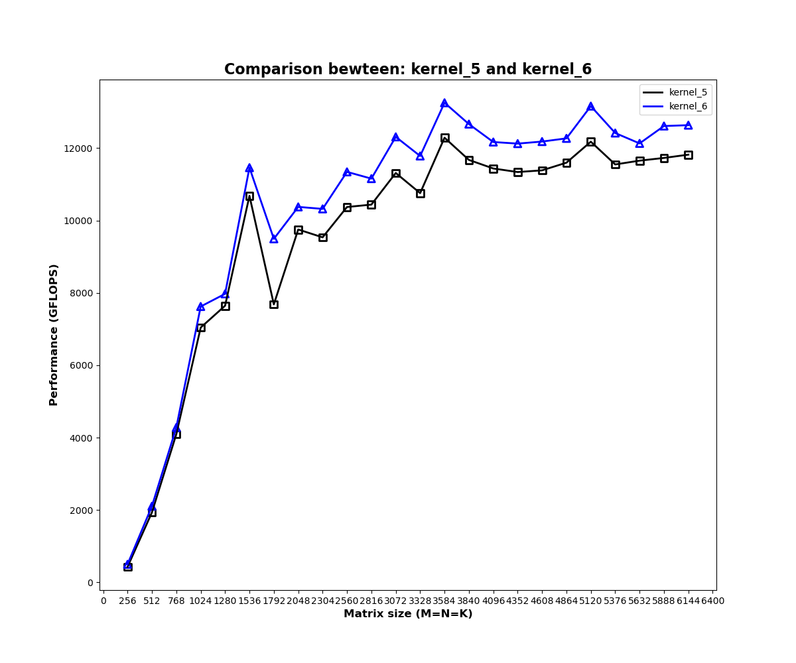

实际测试，整体计算效率增加；

## kernel 7

**数据预取**

单缓存是指申请单块共享内存，缓存全局数据，申请单块寄存器内存，缓存共享数据，单块缓存不能实现读取和存储并行进行，因为数据之间存在依赖。例如单缓存场景，计算依赖共享内存数据，为保证计算前全局内存完全存入共享内存，需要进行一次同步；同样因为计算依赖共享内存数据，所以在存新一轮全局内存到共享内存前也需要进行一次同步，保证上一轮计算完成。

双缓存通过申请双倍存储空间，将读和写分开，计算数据读取一块存储空间同时，可以同时向另一块内存写入下一轮依赖的数据，因此，只需要保证计算前待读取共享内存完成写入，即一次同步即可。

> 双缓存使读写同步进行，实现数据预取，隐藏内存延迟。


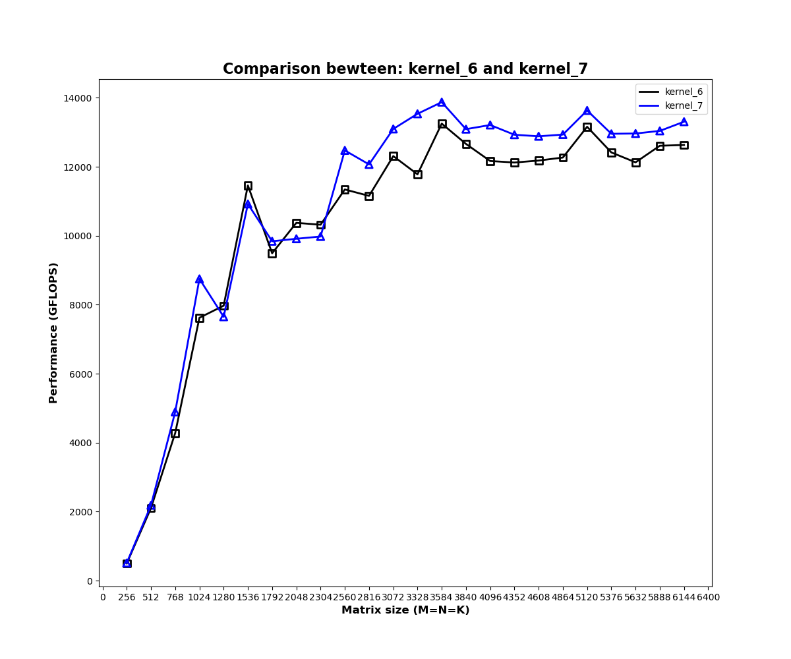

采用双缓存技术实现数据预取，计算效率得到了进一步提升；

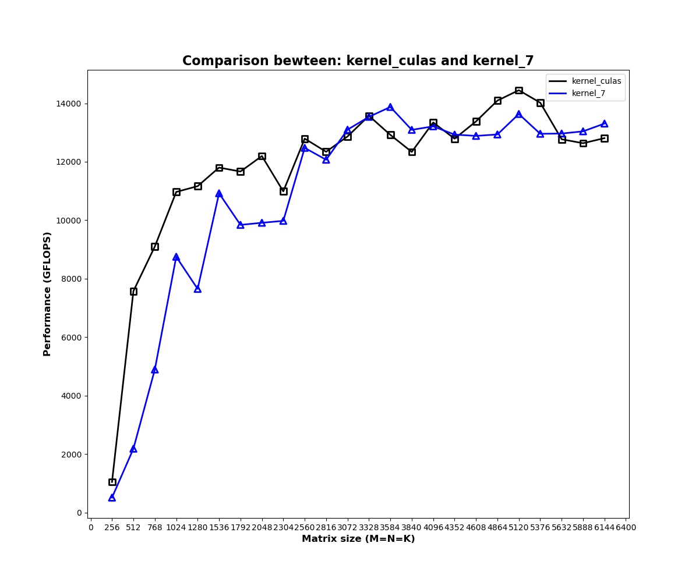

基本可以接近CUBLAS官方矩阵乘法的计算效率；
